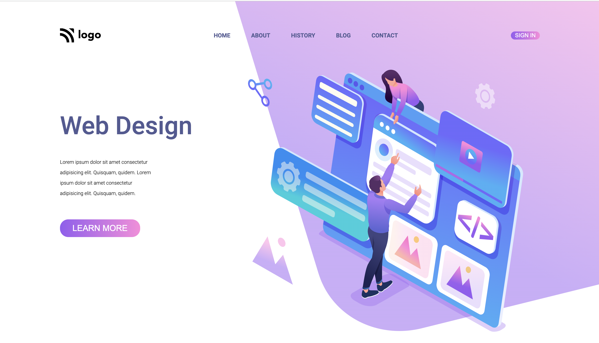

## This is project 8
___

## Learning in This Project are :- 
- Flexbox
- flex-basic
- Positioning
    - relatve
    - absolute
- Background Image details
    - background positions
    - background-repeat
- linear-gradient
- In div how to select nth child

> Time taken : 2 hrs 

> netlify link : - 